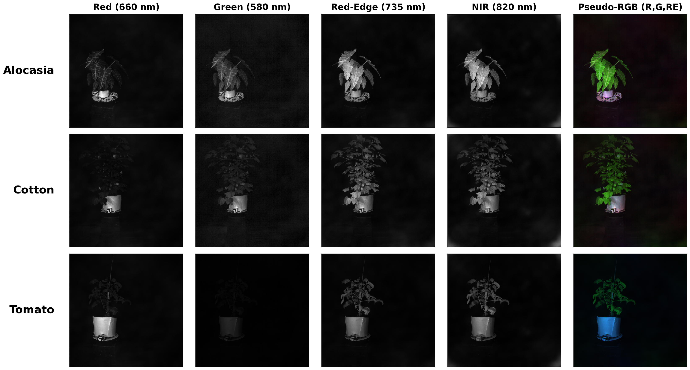
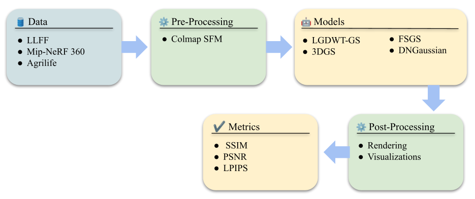

# LGDWT-GS:Local Global Discrete Wavelet Transform for Enhanced 3D Gaussian Splatting

This repository implements **LGDWT-GS**, an enhanced version of 3D Gaussian Splatting that incorporates Discrete Wavelet Transform (DWT) loss functions to improve high-frequency detail preservation and reconstruction quality.
Interactive visualizations, results, and additional details are available on our project website: **https://advanced-vision-and-learning-lab.github.io/LGDWT-GS-website/**


## Overview

DWT 3DGS extends the standard 3D Gaussian Splatting pipeline by incorporating wavelet-domain loss functions. The method applies a 2-level Haar wavelet decomposition to both predicted and ground truth images, computing Charbonnier losses on selected subbands. This enables better preservation of fine details and improved reconstruction of high-frequency content.


The wavelet decomposition separates images into multiple frequency subbands:

- **LL (Low-Low)**: Low-frequency approximation containing the main structure  
- **LH (Low-High)**: Horizontal high-frequency details  
- **HL (High-Low)**: Vertical high-frequency details  
- **HH (High-High)**: Diagonal high-frequency details  

By weighting different subbands, the method can emphasize low-frequency structure while still capturing important high-frequency details.


---


## Multispectral Dataset

This codebase supports **multispectral datasets**, which capture information across multiple spectral bands beyond the visible RGB spectrum. Multispectral imaging enables enhanced analysis and reconstruction of scenes with rich spectral information, making it valuable for applications in agriculture, remote sensing, and scientific imaging.




**Important**: For multispectral datasets, you should run the **multispectral DWT 3DGS** variant. The multispectral version extends the standard DWT loss computation to work across all spectral bands, ensuring consistent quality and detail preservation across the full spectrum.


## Installation

### Requirements

- Python 3.8+
- PyTorch (CUDA-enabled recommended)
- CUDA SDK 11+
- Conda (recommended)

### Setup

1. Clone the repository with submodules:

```bash
git clone <repository-url> --recursive
cd gaussian-splatting-highfrequncy-in-low-frequncy-3
```

2. Create and activate the conda environment:

```bash
conda env create --file environment.yml
conda activate gaussian_splatting
```

3. Install the CUDA extensions:

```bash
pip install submodules/diff-gaussian-rasterization
pip install submodules/simple-knn
```


## Running DWT 3DGS

### Basic Training

To train a model with DWT loss enabled (default):

```bash
python train.py -s <path to COLMAP or NeRF Synthetic dataset>
```


### DWT-Specific Parameters

```bash
python train.py -s <path to dataset> \
    --dwt_enable True \
    --dwt_weight 0.5 \
    --dwt_ll1_weight 1.0 \
    --dwt_ll2_weight 0.5 \
    --dwt_lh1_weight 0.0 \
    --dwt_hl1_weight 0.0 \
    --dwt_hh1_weight 0.0 \
    --dwt_lh2_weight 0.0 \
    --dwt_hl2_weight 0.0 \
    --dwt_hh2_weight 0.0
```

**DWT Parameters:**

- `--dwt_enable`: Enable or disable DWT loss (default: True)  
- `--dwt_weight`: Global weight for DWT loss (default: 0.5)  
- `--dwt_ll1_weight`: Weight for Level 1 LL subband (default: 1.0)  
- `--dwt_ll2_weight`: Weight for Level 2 LL subband (default: 0.5)  
- `--dwt_lh1_weight`, `--dwt_hl1_weight`, `--dwt_hh1_weight`: Weights for Level 1 high-frequency subbands (default: 0.0)  
- `--dwt_lh2_weight`, `--dwt_hl2_weight`, `--dwt_hh2_weight`: Weights for Level 2 high-frequency subbands (default: 0.0)  

The default configuration emphasizes low-frequency components (LL1 and LL2) which typically contain the most important structural information. High-frequency subbands can be enabled for enhanced detail preservation.


### Rendering

After training, render the model:

```bash
python render.py -m <path to trained model>
```

### Evaluation

Compute metrics on rendered images:

```bash
python metrics.py -m <path to trained model>
```

### Training with Evaluation Split

To train with a train or test split for evaluation:

```bash
python train.py -s <path to dataset> --eval
python render.py -m <path to trained model>
python metrics.py -m <path to trained model>
```


## Dataset Format

### COLMAP Format

The code expects COLMAP datasets in the following structure:

```text
<dataset_path>/
├── images/
│   ├── image1.jpg
│   ├── image2.jpg
│   └── ...
└── sparse/
    └── 0/
        ├── cameras.bin
        ├── images.bin
        └── points3D.bin
```


### Converting Your Own Images

Use the provided converter script:

```bash
python convert.py -s <location> [--resize]
```

This will:

1. Run COLMAP to extract camera poses  
2. Undistort images  
3. Optionally resize images (creates 1/2, 1/4, 1/8 resolution versions)  


## Benchmarking



The method has been evaluated on standard 3DGS benchmarks. The DWT loss improves reconstruction quality, particularly for high-frequency details, while maintaining real-time rendering performance.


---
## 📖 Citation

If you use this code or find it useful in your research, please cite both the original 3D Gaussian Splatting paper and our LGDWT-GS work.

### LGDWT-GS

```bibtex
@article{salehi2026lgdwt,
  title   = {LGDWT-GS: Local and Global Discrete Wavelet-Regularized 3D Gaussian Splatting for Sparse-View Scene Reconstruction},
  author  = {Salehi, Shima and Agashe, Atharva and McFarland, Andrew J. and Peeples, Joshua},
  journal = {arXiv preprint arXiv:2601.17185},
  year    = {2026},
  url     = {https://advanced-vision-and-learning-lab.github.io/LGDWT-GS-website/}
}

## License

This project is licensed under the same license as the original 3D Gaussian Splatting codebase. See `LICENSE.md` for details.

---

## Acknowledgments

This work extends the original 3D Gaussian Splatting implementation. We thank the original authors for their excellent work and open-source release.
