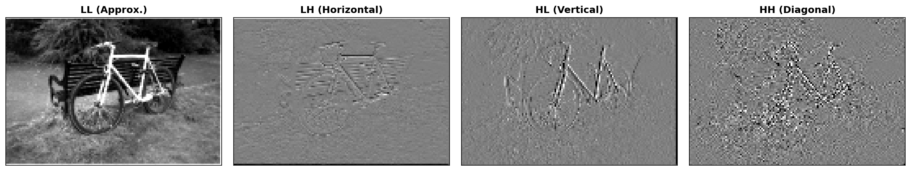

<!DOCTYPE html><html><head><meta charset="utf-8"><title>DWT 3DGS README</title></head><body><h1>DWT 3DGS: Discrete Wavelet Transform for Enhanced 3D Gaussian Splatting</h1>

This repository implements <strong>DWT 3DGS</strong>, an enhanced version of 3D Gaussian Splatting that incorporates Discrete Wavelet Transform (DWT) loss functions to improve high-frequency detail preservation and reconstruction quality.

<h2>Overview</h2>

DWT 3DGS extends the standard 3D Gaussian Splatting pipeline by incorporating wavelet-domain loss functions. The method applies a 2-level Haar wavelet decomposition to both predicted and ground truth images, computing Charbonnier losses on selected subbands. This enables better preservation of fine details and improved reconstruction of high-frequency content.

The wavelet decomposition separates images into multiple frequency subbands:
- <strong>LL (Low-Low)</strong>: Low-frequency approximation containing the main structure
- <strong>LH (Low-High)</strong>: Horizontal high-frequency details
- <strong>HL (High-Low)</strong>: Vertical high-frequency details 
- <strong>HH (High-High)</strong>: Diagonal high-frequency details

By weighting different subbands, the method can emphasize low-frequency structure while still capturing important high-frequency details.

<h2>Method</h2>

DWT 3DGS enhances 3D Gaussian Splatting by:

<ol>
<li><strong>Wavelet Decomposition</strong>: Applying 2-level Haar wavelet transform to decompose images into frequency subbands</li>
<li><strong>Multi-scale Loss</strong>: Computing Charbonnier losses on selected wavelet subbands (LL1, LL2, and optionally high-frequency bands)</li>
<li><strong>Adaptive Scaling</strong>: Using running-mean ratio scaling to balance DWT loss with the base L1+SSIM loss</li>
<li><strong>GPU Optimization</strong>: Fast GPU-accelerated wavelet decomposition using pure PyTorch operations</li>
</ol>

The method is particularly effective at preserving high-frequency details that are often lost in standard reconstruction approaches, while maintaining the real-time rendering capabilities of 3D Gaussian Splatting.

<h2>Multispectral Dataset</h2>

This codebase supports training on <strong>multispectral datasets</strong>, which capture information across multiple spectral bands beyond the visible RGB spectrum. Multispectral imaging enables enhanced analysis and reconstruction of scenes with rich spectral information, making it valuable for applications in agriculture, remote sensing, and scientific imaging.

<strong>Important</strong>: For multispectral datasets, you should run the <strong>multispectral DWT 3DGS</strong> variant. The multispectral version extends the standard DWT loss computation to work across all spectral bands, ensuring consistent quality and detail preservation across the full spectrum.

<h2>Installation</h2>
<h3>Requirements</h3>
<ul>
<li>Python 3.8+</li>
<li>PyTorch (CUDA-enabled recommended)</li>
<li>CUDA SDK 11+</li>
<li>Conda (recommended)</li>
</ul>
<h3>Setup</h3>
<ol>
<li>Clone the repository with submodules:</li>
</ol>
<pre><code class="language-shell">git clone &lt;repository-url&gt; --recursive
cd gaussian-splatting-highfrequncy-in-low-frequncy-3
</code></pre>
<ol>
<li>Create and activate the conda environment:</li>
</ol>
<pre><code class="language-shell">conda env create --file environment.yml
conda activate gaussian_splatting
</code></pre>
<ol>
<li>Install the CUDA extensions:</li>
</ol>
<pre><code class="language-shell">pip install submodules/diff-gaussian-rasterization
pip install submodules/simple-knn
</code></pre>

<h2>Running DWT 3DGS</h2>
<h3>Basic Training</h3>

To train a model with DWT loss enabled (default):

<pre><code class="language-shell">python train.py -s &lt;path to COLMAP or NeRF Synthetic dataset&gt;
</code></pre>
<h3>DWT-Specific Parameters</h3>

The DWT loss is enabled by default. You can control DWT behavior using the following parameters:

<pre><code class="language-shell">python train.py -s &lt;path to dataset&gt; \
    --dwt_enable True \
    --dwt_weight 0.5 \
    --dwt_ll1_weight 1.0 \
    --dwt_ll2_weight 0.5 \
    --dwt_lh1_weight 0.0 \
    --dwt_hl1_weight 0.0 \
    --dwt_hh1_weight 0.0 \
    --dwt_lh2_weight 0.0 \
    --dwt_hl2_weight 0.0 \
    --dwt_hh2_weight 0.0
</code></pre>

<strong>DWT Parameters:</strong>
- <code>--dwt_enable</code>: Enable/disable DWT loss (default: True)
- <code>--dwt_weight</code>: Global weight for DWT loss (default: 0.5)
- <code>--dwt_ll1_weight</code>: Weight for Level 1 LL subband (default: 1.0)
- <code>--dwt_ll2_weight</code>: Weight for Level 2 LL subband (default: 0.5)
- <code>--dwt_lh1_weight</code>, <code>--dwt_hl1_weight</code>, <code>--dwt_hh1_weight</code>: Weights for Level 1 high-frequency subbands (default: 0.0)
- <code>--dwt_lh2_weight</code>, <code>--dwt_hl2_weight</code>, <code>--dwt_hh2_weight</code>: Weights for Level 2 high-frequency subbands (default: 0.0)

The default configuration emphasizes low-frequency components (LL1 and LL2) which typically contain the most important structural information. High-frequency subbands can be enabled for enhanced detail preservation.

<h3>Rendering</h3>

After training, render the model:

<pre><code class="language-shell">python render.py -m &lt;path to trained model&gt;
</code></pre>
<h3>Evaluation</h3>

Compute metrics on rendered images:

<pre><code class="language-shell">python metrics.py -m &lt;path to trained model&gt;
</code></pre>
<h3>Training with Evaluation Split</h3>

To train with a train/test split for evaluation:

<pre><code class="language-shell">python train.py -s &lt;path to dataset&gt; --eval
python render.py -m &lt;path to trained model&gt;
python metrics.py -m &lt;path to trained model&gt;
</code></pre>
<h2>Packages and Utilities</h2>

This codebase includes several custom packages and utilities specifically created for DWT-based training:

<h3>Core DWT Utilities (<code>utils/loss_utils.py</code>)</h3>

The main DWT functionality is implemented in <code>utils/loss_utils.py</code>:

<ul>
<li><strong><code>get_dwt_subbands(x)</code></strong>: Fast GPU-accelerated 2-level Haar wavelet decomposition</li>
<li>Input: PyTorch tensor of shape (N, C, H, W)</li>
<li>Returns: Dictionary with 8 subbands: <code>{'LL1', 'LH1', 'HL1', 'HH1', 'LL2', 'LH2', 'HL2', 'HH2'}</code></li>
<li>Optimized for GPU computation using depthwise convolutions</li>
<li>

No external dependencies beyond PyTorch

</li>
<li>

<strong><code>charbonnier_loss(pred, target, epsilon=1e-3)</code></strong>: Robust loss function for subband comparison

</li>
<li>More stable than L2 loss for high-frequency content</li>
<li>Includes epsilon parameter for numerical stability</li>
<li>

Formula: <code>sqrt((pred - target)^2 + epsilon^2)</code>

</li>
<li>

<strong>Wavelet Error Field (WEF) utilities</strong>: 

</li>
<li><code>compute_wef_maps()</code>: Compute error maps in wavelet space</li>
<li><code>make_heatmap_rgb()</code>: Visualize error maps as RGB heatmaps</li>
<li><code>compute_wef_all_subbands()</code>: Compute errors for all subbands</li>
<li><code>make_wef_grid_image()</code>: Create grid visualizations of wavelet errors</li>
</ul>
<h3>Training Integration (<code>train.py</code>)</h3>

The DWT loss is seamlessly integrated into the training loop:

<ul>
<li><strong>Automatic Scaling</strong>: Running-mean ratio scaling balances DWT loss with base L1+SSIM loss</li>
<li><strong>TensorBoard Logging</strong>: All DWT subband losses are logged for monitoring</li>
<li><strong>Efficient Computation</strong>: GPU-accelerated wavelet decomposition during training</li>
<li><strong>Flexible Weighting</strong>: Per-subband weights allow fine-grained control</li>
</ul>
<h3>Testing and Validation</h3>
<ul>
<li><strong><code>test_pytorch_wavelets.py</code></strong>: Validation script for DWT subband computation</li>
<li>Tests wavelet decomposition correctness</li>
<li>Validates subband shapes and properties</li>
<li>

Includes fallback implementation testing

</li>
<li>

<strong><code>DWT_Scaling_Test.ipynb</code></strong>: Jupyter notebook for interactive testing

</li>
<li>Test DWT loss scaling on real images</li>
<li>Visualize wavelet subbands</li>
<li>Experiment with different weight configurations</li>
</ul>
<h3>Dataset Readers (<code>scene/dataset_readers.py</code>)</h3>

Extended dataset readers support:
- Standard COLMAP datasets
- NeRF Synthetic datasets
- Multispectral datasets (with proper channel handling)

<h3>Gaussian Model (<code>scene/gaussian_model.py</code>)</h3>

The Gaussian model implementation supports:
- Standard 3DGS optimization
- DWT-enhanced loss computation
- Exposure compensation (optional)
- Depth regularization (optional)

<h2>Dataset Format</h2>
<h3>COLMAP Format</h3>

The code expects COLMAP datasets in the following structure:

<pre><code>&lt;dataset_path&gt;/
├── images/
│   ├── image1.jpg
│   ├── image2.jpg
│   └── ...
└── sparse/
    └── 0/
        ├── cameras.bin
        ├── images.bin
        └── points3D.bin
</code></pre>
<h3>Converting Your Own Images</h3>

Use the provided converter script:

<pre><code class="language-shell">python convert.py -s &lt;location&gt; [--resize]
</code></pre>

This will:
1. Run COLMAP to extract camera poses
2. Undistort images
3. Optionally resize images (creates 1/2, 1/4, 1/8 resolution versions)

<h2>Benchmarking</h2>

The method has been evaluated on standard 3DGS benchmarks. The DWT loss improves reconstruction quality, particularly for high-frequency details, while maintaining real-time rendering performance.

<h2>Citation</h2>

If you use this code, please cite the original 3D Gaussian Splatting paper and our DWT extension:

<pre><code class="language-bibtex">@Article{kerbl3Dgaussians,
    author       = {Kerbl, Bernhard and Kopanas, Georgios and Leimk{\&quot;u}hler, Thomas and Drettakis, George},
    title        = {3D Gaussian Splatting for Real-Time Radiance Field Rendering},
    journal      = {ACM Transactions on Graphics},
    number       = {4},
    volume       = {42},
    month        = {July},
    year         = {2023},
    url          = {https://repo-sam.inria.fr/fungraph/3d-gaussian-splatting/}
}
</code></pre>
<h2>License</h2>

This project is licensed under the same license as the original 3D Gaussian Splatting codebase. See <code>LICENSE.md</code> for details.

<h2>Acknowledgments</h2>

This work extends the original 3D Gaussian Splatting implementation. We thank the original authors for their excellent work and open-source release.
</body></html>
