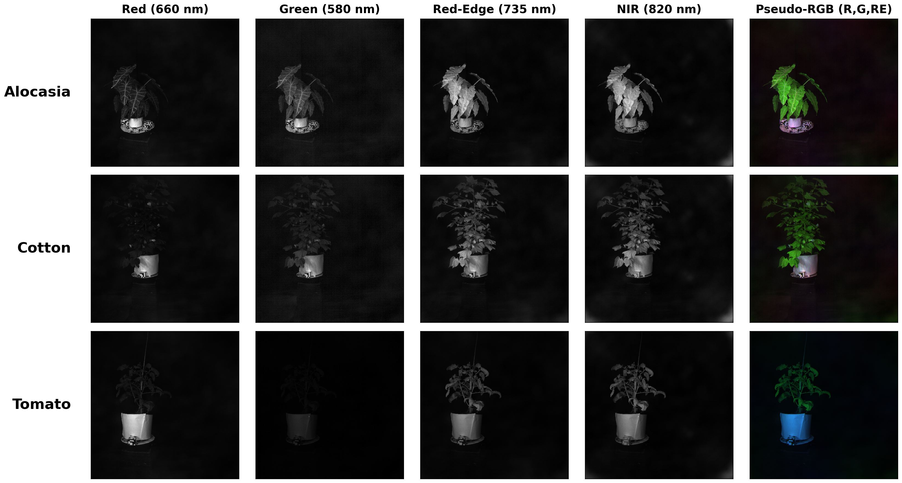
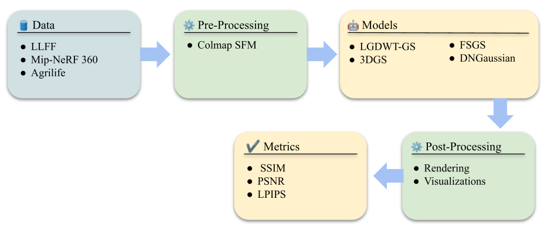

# LGDWT-GS:Local Global Discrete Wavelet Transform for Enhanced 3D Gaussian Splatting

LGDWT-GS extends the standard 3D Gaussian Splatting pipeline by introducing local and global wavelet-domain supervision. The method applies a Haar wavelet decomposition to both predicted and ground-truth rendered images and adds wavelet-based L1 losses on selected subbands to the standard photometric loss. This formulation enables the model to preserve global structural consistency while also recovering local fine-grained details, leading to improved reconstruction quality, particularly under sparse-view conditions. To capture local details, LGDWT-GS focuses on high-frequency information embedded within low-frequency baches.
Interactive visualizations,Dataset, results, and additional details are available on our project website: **https://advanced-vision-and-learning-lab.github.io/LGDWT-GS-website/**


---


## Multispectral Dataset

This codebase supports **multispectral datasets**, which capture information across multiple spectral bands beyond the visible RGB spectrum. Multispectral imaging enables enhanced analysis and reconstruction of scenes with rich spectral information, making it valuable for applications in agriculture, remote sensing, and scientific imaging.

### 📦 Dataset Download

The multispectral dataset is publicly available on Zenodo.

🔗 **[Download here](https://doi.org/10.5281/zenodo.18838172)**

Please cite the dataset if you use it in your research.




**Important**: For multispectral datasets, you should run the **multi-DWTGS variant using `train_nir.py`**. The multispectral version extends the standard DWT loss computation to work across all spectral bands, ensuring consistent quality and detail preservation across the full spectrum. Do not use the standard `train.py` script for multispectral datasets.
Multi-Spectral Data Loading:
RGB+NIR image pairs: Supports datasets with separate RGB and NIR images for true 3D multispectral reconstruction
Image format: The images/ folder should contain RGB images (3-channel- Pseudo RGB) and nir/folder should contain NIR channel for RGB+NIR datasets, and use the colmap on top of RGB images.

## Installation

### Requirements

- Python 3.8+
- PyTorch (CUDA-enabled recommended)
- CUDA SDK 11+
- Conda (recommended)

### Setup

1. Clone the repository with submodules:

```bash
git clone <repository-url> --recursive
cd gaussian-splatting-highfrequncy-in-low-frequncy-3
```

2. Create and activate the conda environment:

```bash
conda env create --file environment.yml
conda activate gaussian_splatting
```

3. Install the CUDA extensions:

```bash
pip install submodules/diff-gaussian-rasterization
pip install submodules/simple-knn
```


## Running DWT 3DGS

### Basic Training

To train a model with DWT loss enabled (default):

```bash
python train.py -s <path to COLMAP or NeRF Synthetic dataset>
```


**DWT Parameters:**

- `--dwt_enable`: Enable or disable DWT loss   
- `--dwt_weight`: Global weight for DWT loss 
- `--dwt_ll1_weight`: Weight for Global Low frequency
- `--dwt_ll2_weight`: Weight for Local Low frequency
- `--dwt_lh1_weight`, `--dwt_hl1_weight`, `--dwt_hh1_weight`:Weights for Global high frequency
- `--dwt_lh2_weight`, `--dwt_hl2_weight`, `--dwt_hh2_weight`:Weights for Local high frequency

The default configuration emphasizes low-frequency components (LL1 and LL2) which typically contain the most important structural information. High-frequency subbands can be enabled for enhanced detail preservation.

## DWT Regularization Parameters

Our method introduces a multi-scale wavelet regularization strategy divided into **Global** and **Patch-wise** components. You can fine-tune these parameters to balance structural consistency and high-frequency detail preservation.

### 1. Global DWT (Full Image)
Controls the frequency matching across the entire rendered image.

- `--dwt_enable`: Enable or disable the Global DWT loss.
- `--dwt_weight`: Overall scaling factor for the global DWT loss.
- **Level 1 Subbands (Fine details):**
  - `--dwt_ll1_weight`: Weight for LL1 (Approximation/Structure).
  - `--dwt_lh1_weight`: Weight for LH1 (Horizontal details).
  - `--dwt_hl1_weight`: Weight for HL1 (Vertical details).
  - `--dwt_hh1_weight`: Weight for HH1 (Diagonal details).
- **Level 2 Subbands (Coarse details):**
  - `--dwt_ll2_weight`: Weight for LL2.
  - `--dwt_lh2_weight`, `--dwt_hl2_weight`, `--dwt_hh2_weight`: Weights for Level 2 high-frequency bands.

### 2. Patch-wise DWT (Local Regions)
Focuses regularization on specific regions of the image based on the Energy of Low Frequency (ELF).

- `--patch_dwt_enable`: Enable or disable the Patch-wise DWT loss.
- `--patch_dwt_weight`: Overall weight for the patch loss (Beta).
- `--patch_size`: Size of the patches to extract (default: 128).
- `--patch_percentile`: Threshold for patch selection based on ELF (e.g., `0.2` selects the top/bottom 20% of patches).
- **Patch Subband Weights:**
  - `--patch_dwt_lh1_weight`: Weight for LH1 in selected patches.
  - `--patch_dwt_hl1_weight`: Weight for HL1 in selected patches.

---

### 💡 Hyperparameter Tuning & Dataset Sensitivity

**Important Note:** The optimal values for these parameters diffrent from dataset to dataset.
*   **Structure vs. Detail:** Increasing `LL` weights emphasizes structural correctness, while increasing `LH/HL/HH` weights improves texture sharpness.
*   **Scene Characteristics:** Scenes with high-frequency textures (e.g., foliage) may require different subband weights compared to smoother scenes (e.g., indoor walls).


### Rendering

After training, render the model:

```bash
python render.py -m <path to trained model>
```

### Evaluation

Compute metrics on rendered images:

```bash
python metrics.py -m <path to trained model>
```

### Training with Evaluation Split

To train with a train or test split for evaluation:

```bash
python train.py -s <path to dataset> --eval
python render.py -m <path to trained model>
python metrics.py -m <path to trained model>
```


## Dataset Format

### COLMAP Format

The code expects COLMAP datasets in the following structure:

```text
<dataset_path>/
├── images/
│   ├── image1.jpg
│   ├── image2.jpg
│   └── ...
└── sparse/
    └── 0/
        ├── cameras.bin
        ├── images.bin
        └── points3D.bin
```


### Converting Your Own Images

Use the provided converter script:

```bash
python convert.py -s <location> [--resize]
```

This will:

1. Run COLMAP to extract camera poses  
2. Undistort images  
3. Optionally resize images (creates 1/2, 1/4, 1/8 resolution versions)  


## Benchmarking



The method has been evaluated on standard 3DGS benchmarks. The DWT loss improves reconstruction quality, particularly for high-frequency details, while maintaining real-time rendering performance.


---
## Citation

If you use this code or find it useful in your research, please cite both the original 3D Gaussian Splatting paper and our LGDWT-GS work.

### LGDWT-GS

```bibtex
@article{salehi2026lgdwt,
  title   = {LGDWT-GS: Local and Global Discrete Wavelet-Regularized 3D Gaussian Splatting for Sparse-View Scene Reconstruction},
  author  = {Salehi, Shima and Agashe, Atharva and McFarland, Andrew J. and Peeples, Joshua},
  journal = {arXiv preprint arXiv:2601.17185},
  year    = {2026},
  url     = {https://arxiv.org/abs/2601.17185}
}

## License

This project is licensed under the same license as the original 3D Gaussian Splatting codebase. See `LICENSE.md` for details.

---

## Acknowledgments

This work extends the original 3D Gaussian Splatting implementation. We thank the original authors for their excellent work and open-source release.
